# M&M Market Research Agency 

M&M agency offers valuable research services to clients, aiding them in making informed business decisions. This project is for a clients who are interested in the jeans market. The goal of this project is to display collected information about different brands of jeans and thus help clients in making business decisions.

## Features

### Display of the Month with the Highest Demand

▪︎ When the user enter number 1, new line is added to "prices" in the google sheet which represents the month with the highest demand.

▪︎ December is the month with the highest demand. 

 

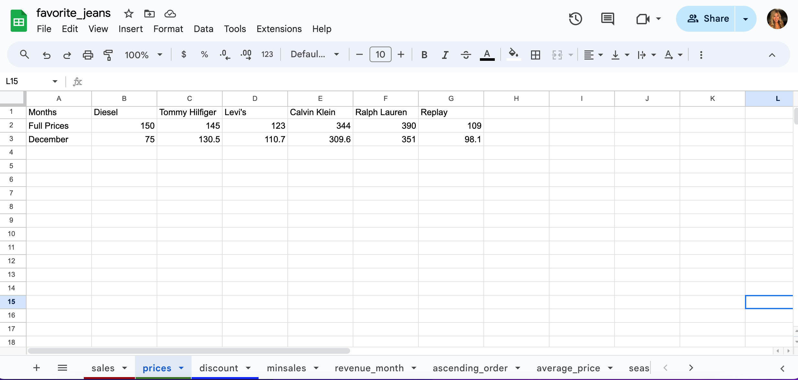

### Display of the Lowest Sales by Brand

▪︎ When the user enter number 2, new line is added to "minsales" in the google sheet which represents the lowest sales by brand. 

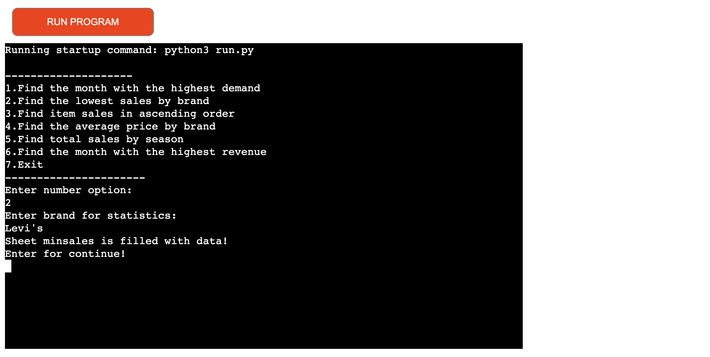

▪︎ There is also a display of the month with the lowest sale by brand and display of the date when the user performs the search. 

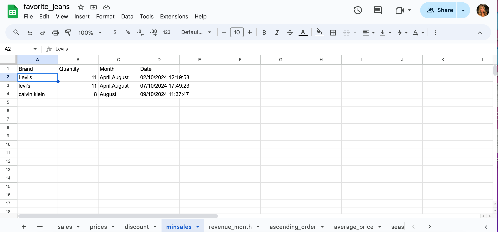

### Display of the Sales Items in Ascending Order

▪︎ When the user enter number 3, new line is added to "ascending_order" in the google sheet which represents the sales items in ascending order.

▪︎ Tommy Hilfiger jeans has the maximum sales and Raulph Lauren has the minimum sales.

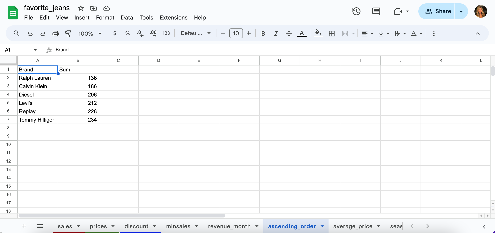

### Display of the Average Price by Brand

▪︎ When the user enter number 4, new line is added to "average_price" in the google sheet which represents the average price by brand.

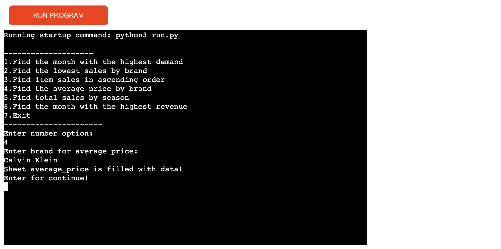

▪︎ Diesel jeans is the brand with the average price.

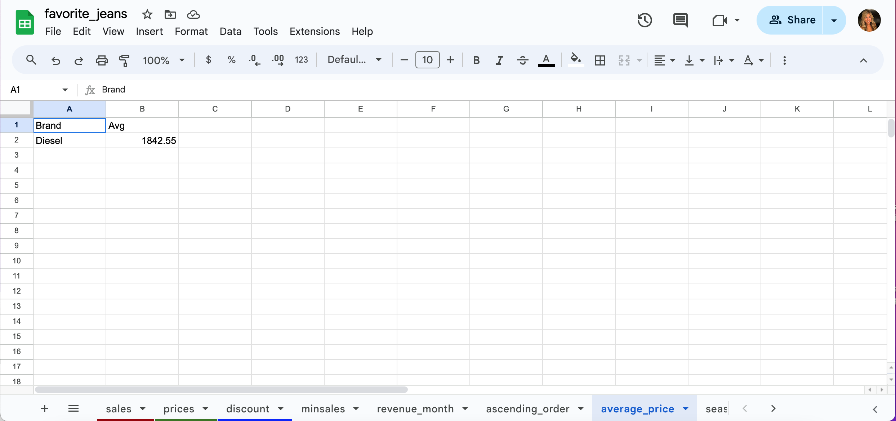

### Display of the Total Sales by Season

▪︎ When the user enter number 5, new line is added to "season" in the google sheet which represents the total sales by season.

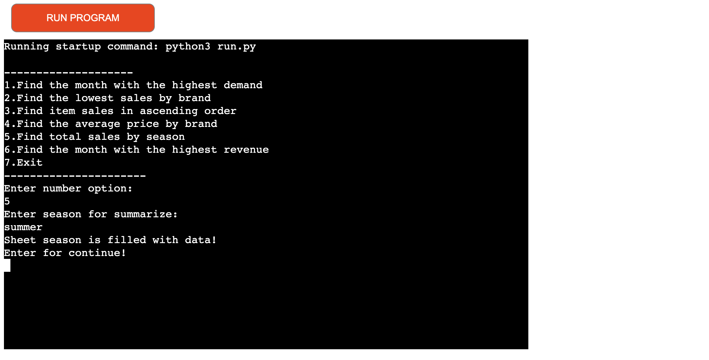

▪︎ Winter season has the biggest sale.

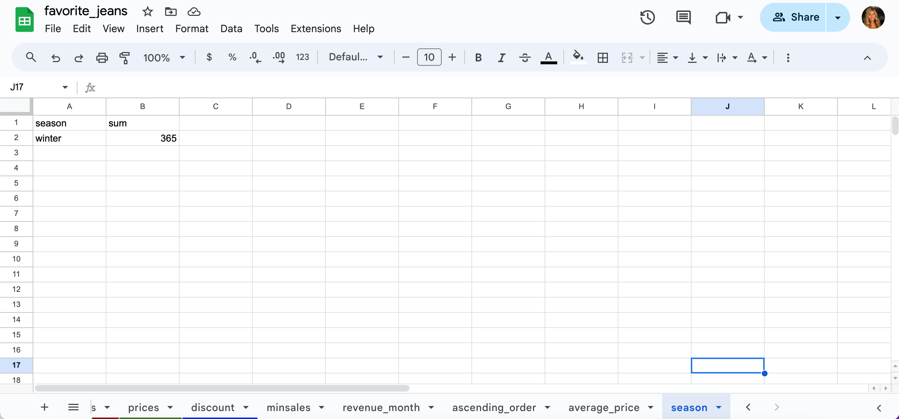

   

### Display of the Month with the Highest Revenue

▪︎ When the user enter number 6, new line is added to "revenue_month" in the google sheet which represents the month with the highest revenue.

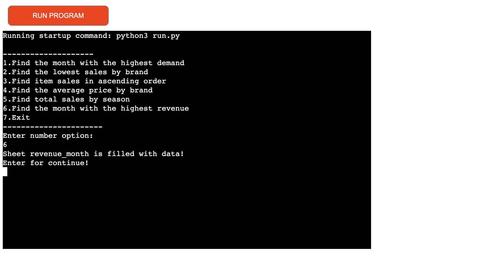

▪︎ December is the month with the highest revenue. 

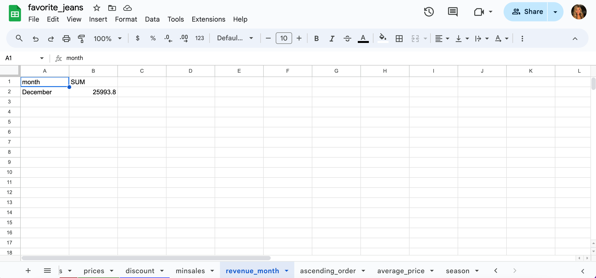

### Exit from the application

▪︎ Option number 7 represents the exit from the application.

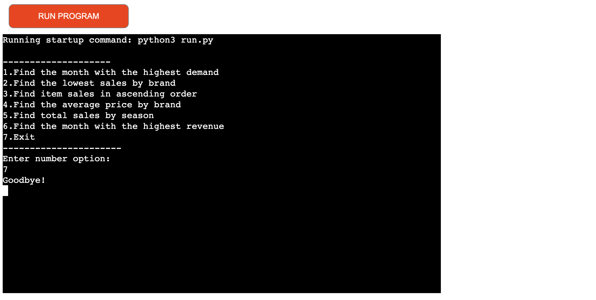

## Testing

▪︎ I have manually tasted the project in my local terminal and the Code Institute Heroku terminal, there were no a problems. 

▪︎ When I passed the code through CI Python Linter , there were some errors like: 

