# M&M Market Research Agency 

M&M agency is a specialized company that gathers, analyzes, and interprets data to help businesses understand their target markets, customers, and competitors. This project is for a clients who are interested in the jeans market. The goal of this project is to display collected information about different brands of jeans and thus help clients in making business decisions.

[HERE](https://favorite-jeans-028b4a1b77fc.herokuapp.com/)  is the live version of my project.

## Features

### Display of the Month with the Highest Demand

▪︎ When the user enter number 1, new line is added to "prices" in the google sheet which represents the month with the highest demand.

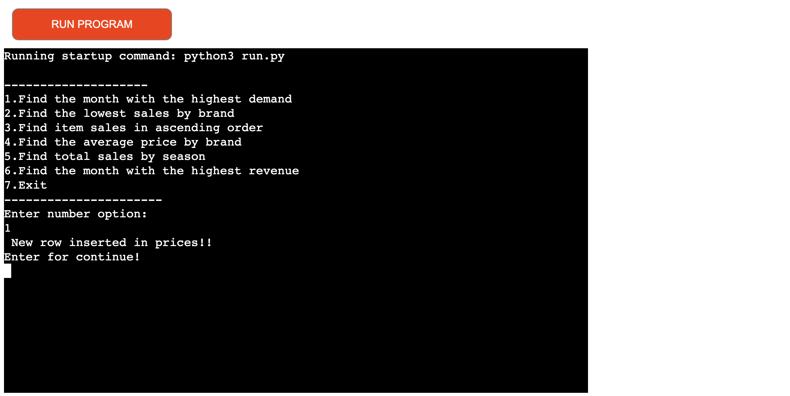

▪︎ December is the month with the highest demand. 

 

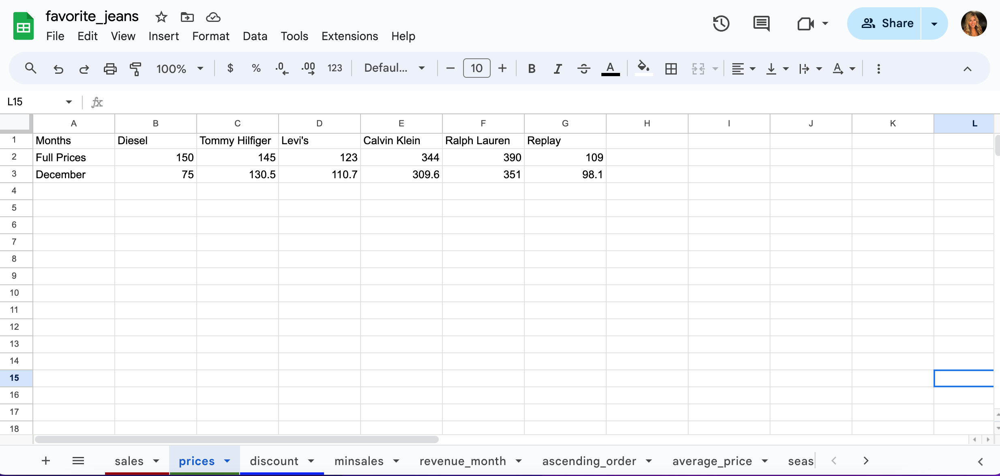

### Display of the Lowest Sales by Brand

▪︎ When the user enter number 2, new line is added to "minsales" in the google sheet which represents the lowest sales by brand. 

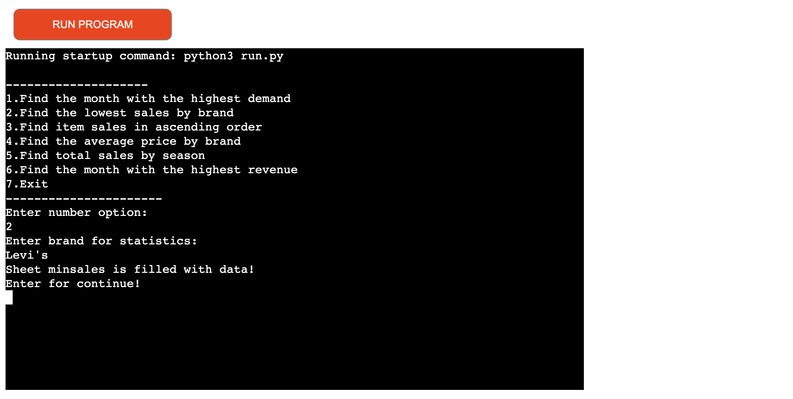

▪︎ There is also a display of the month with the lowest sale by brand and display of the date when the user performs the search. 

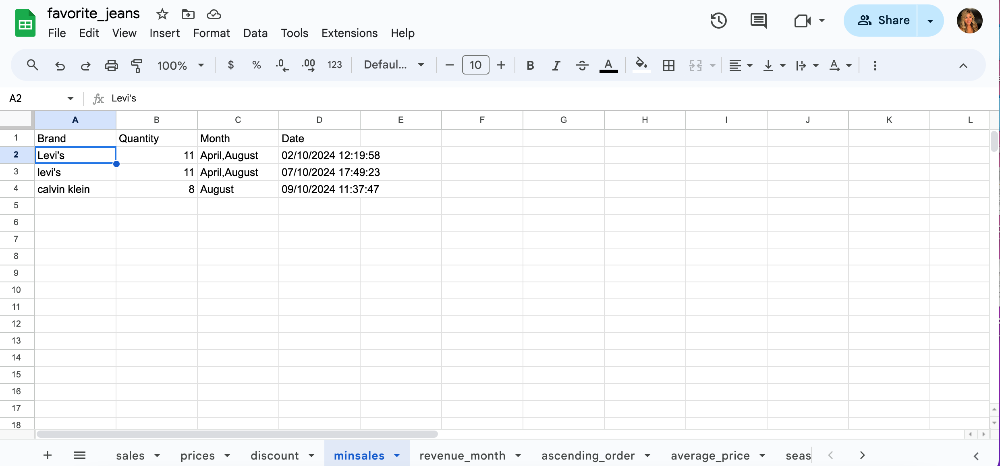

### Display of the Sales Items in Ascending Order

▪︎ When the user enter number 3, new line is added to "ascending_order" in the google sheet which represents the sales items in ascending order.

▪︎ Tommy Hilfiger jeans has the maximum sales and Raulph Lauren has the minimum sales.

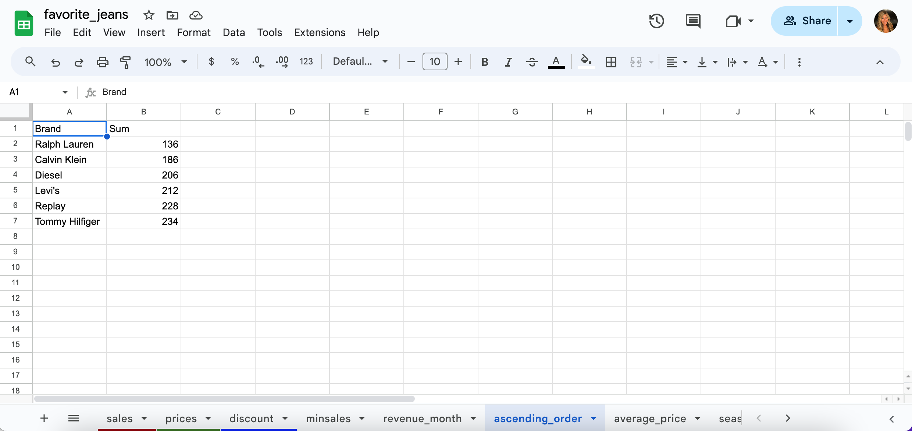

### Display of the Average Price by Brand

▪︎ When the user enter number 4, new line is added to "average_price" in the google sheet which represents the average price by brand.

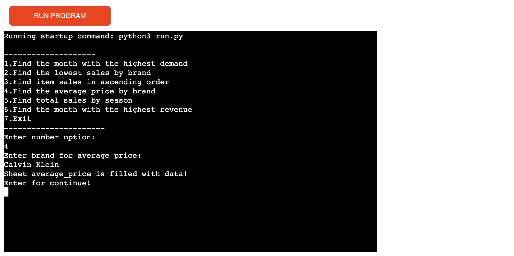

▪︎ Diesel jeans is the brand with the average price.

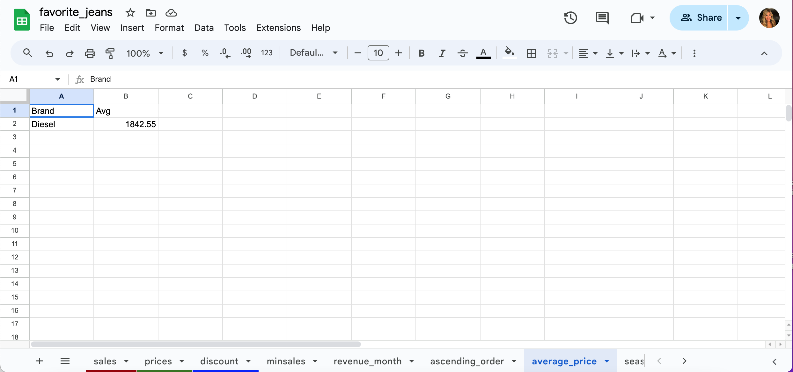

### Display of the Total Sales by Season

▪︎ When the user enter number 5, new line is added to "season" in the google sheet which represents the total sales by season.

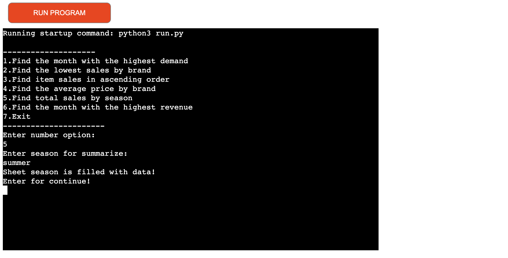

▪︎ Winter season has the biggest sale.

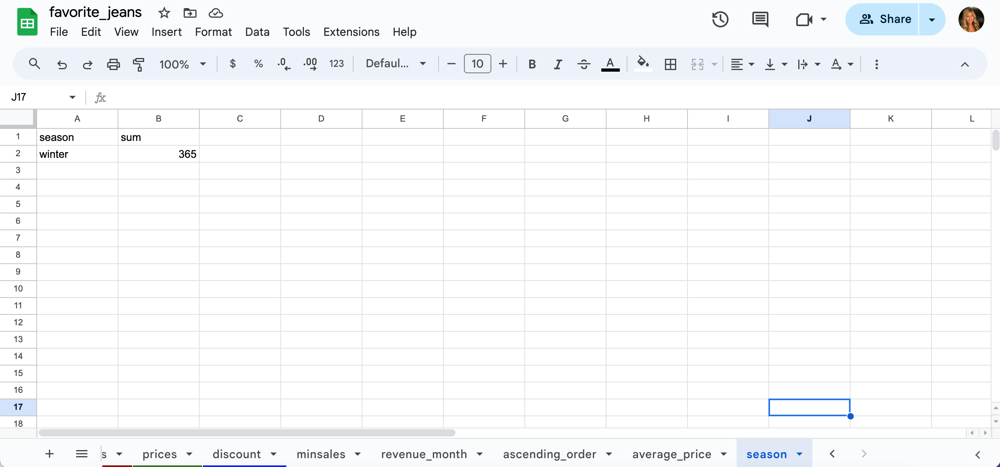

   

### Display of the Month with the Highest Revenue

▪︎ When the user enter number 6, new line is added to "revenue_month" in the google sheet which represents the month with the highest revenue.

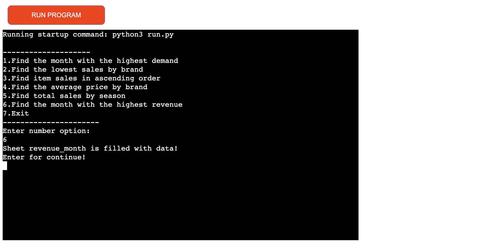

▪︎ December is the month with the highest revenue. 

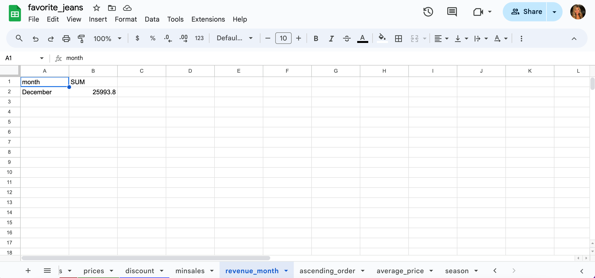

### Exit from the application

▪︎ Option number 7 represents the exit from the application.

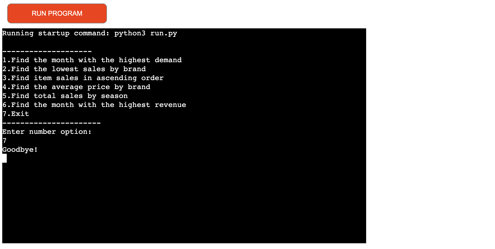

## Future Features

▪︎ A comparison of in-store sales and online sales.

▪︎ Analysis of domestic and international sales.

▪︎ Compare different models of jeans by brand, for example high-rise vs. low-rise,
  baggy vs. skinny.

## Testing

▪︎ I have manually tasted the project in my local terminal and the Code Institute Heroku terminal, there were no a problems. 

#### Validater Testing

▪︎ CI Python Linter

    ▫︎ When I passed the code through CI Python Linter , there were warnings like
    W291 trailing whitespace, W293 blank line contains whitespace and there were 2 errors: 
    E741 ambiguous variable name - which I fixed it and E501 line too long -  it's still   unsolved.

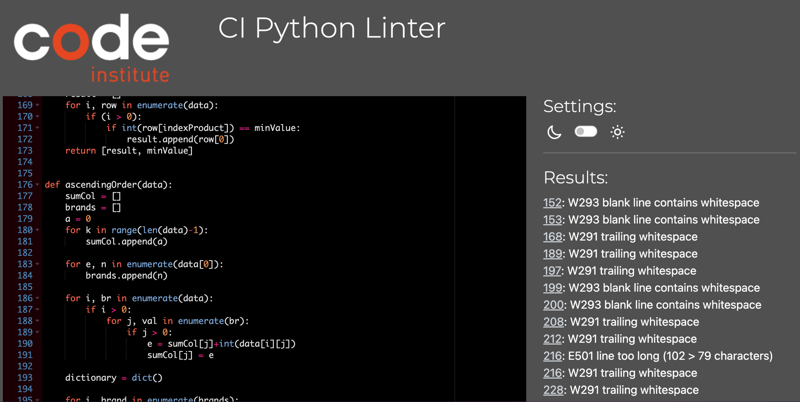

#### Bugs

###### ▪︎ Solved bugs

    ▫︎ There was an issue with deployment. I noticed that "pip3 freeze > requirements.txt"
      was spelled wrong.

###### ▪︎ Unsolved bugs

    ▫︎ No remaining bugs. 

## Deployment

The Application has been deployed from GitHub to Heroku by following steps:

1. Log in or Create a new account on Heroku.
2. On the home page click "New" and then select "Create new app".
3. Choose a unique app name and select the region.
4. Click "Create app".
5. On the next page look for "Settings" and locate "Config Vars".
6. Click "Reveal Config Vars" and add "PORT" as a key and the value "8000", then click "Add".
7. Scroll down, locate "Buildpack" and click "Add", select "Python".
8. Repeat step number 7, only this time add "Node.js", make sure "Python" is first.
9. Scroll to the top and select "Deploy" tab.
10. Select GitHub as deployment method and search for your repository and link them together.
11. Select either "Enable Automatic Deploys" or "Manual Deploy".

## Credit

▪︎ Code Insitute tutors for support.

▪︎ My mentor Jubril for helpful feedback.

▪︎ Slack Community for encouragement.

